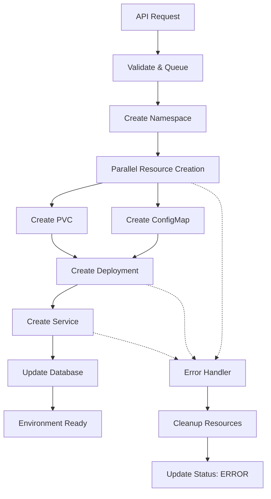

# DevPocket Kubernetes Architecture

## Overview

DevPocket uses an advanced Kubernetes architecture to provide reliable, self-healing development environments. The system leverages Kubernetes Deployments instead of standalone Pods to ensure high availability and automatic recovery from failures.

## Core Architectural Principles

### 1. Self-Healing Infrastructure
- **Kubernetes Deployments** automatically restart failed pods
- **Health Checks** monitor application status and trigger recovery
- **Replica Management** ensures desired state is maintained
- **Resource Limits** prevent resource exhaustion and cascading failures

### 2. Fast Environment Operations
- **Parallel Provisioning** creates resources simultaneously where safe
- **Scaling-Based Operations** use replica scaling (0↔1) for start/stop
- **Configuration Preservation** maintains all Kubernetes resources during lifecycle
- **Quick Recovery** enables fast restart without resource recreation

### 3. Resource Isolation and Security
- **Namespace Isolation** separates users and environments
- **Network Policies** control inter-environment communication
- **Resource Quotas** prevent abuse and ensure fair usage
- **Security Contexts** enforce least-privilege access

## Environment Lifecycle Architecture

### Environment Creation Process



#### Parallel Resource Creation Benefits
- **30-50% Faster Deployment**: PVC and ConfigMap created simultaneously
- **Better Error Handling**: Individual resource failures don't block others
- **Resource Dependency Management**: Deployment waits for dependencies
- **Atomic Operations**: All-or-nothing resource creation with cleanup

### Environment Start/Stop Architecture

#### Traditional Pod Management (Previous)
```
Stop: DELETE Pod → Wait → Resources Lost
Start: CREATE Pod → Pull Image → Configure → Ready (1-5 minutes)
```

#### Deployment Scaling (Current)
```
Stop: SCALE Deployment 1→0 → Graceful Shutdown (10-30 seconds)
Start: SCALE Deployment 0→1 → Fast Startup (10-30 seconds)
```

#### Benefits of Scaling-Based Operations
1. **Speed**: 10-30 seconds vs 1-5 minutes
2. **Reliability**: Preserves all configuration and network endpoints
3. **Storage Persistence**: Data remains intact during start/stop cycles
4. **Network Stability**: Service endpoints never change
5. **Resource Efficiency**: No image pulls or configuration recreation

## Kubernetes Resource Architecture

### Per-Environment Resources

Each development environment consists of:

```yaml
# Namespace: devpocket-{userId}
apiVersion: v1
kind: Namespace
metadata:
  name: devpocket-user123
  labels:
    app.kubernetes.io/name: devpocket
    app.kubernetes.io/component: user-namespace
```

```yaml
# Deployment: env-{environmentId}
apiVersion: apps/v1
kind: Deployment
metadata:
  name: env-abc123
  namespace: devpocket-user123
spec:
  replicas: 1  # 0 when stopped, 1 when running
  selector:
    matchLabels:
      app.kubernetes.io/name: env-abc123
  template:
    spec:
      containers:
      - name: environment
        image: python:3.11-slim
        resources:
          requests:
            cpu: "500m"
            memory: "1Gi"
          limits:
            cpu: "1000m"
            memory: "2Gi"
        livenessProbe:
          httpGet:
            path: /health
            port: 8080
          initialDelaySeconds: 30
          periodSeconds: 10
        readinessProbe:
          httpGet:
            path: /health
            port: 8080
          initialDelaySeconds: 5
          periodSeconds: 5
```

```yaml
# PVC: pvc-{environmentId}
apiVersion: v1
kind: PersistentVolumeClaim
metadata:
  name: pvc-abc123
  namespace: devpocket-user123
spec:
  accessModes:
    - ReadWriteOnce
  resources:
    requests:
      storage: 10Gi
```

```yaml
# Service: svc-{environmentId}
apiVersion: v1
kind: Service
metadata:
  name: svc-abc123
  namespace: devpocket-user123
spec:
  selector:
    app.kubernetes.io/name: env-abc123
  ports:
  - port: 8080
    targetPort: 8080
```

```yaml
# ConfigMap: config-{environmentId}
apiVersion: v1
kind: ConfigMap
metadata:
  name: config-abc123
  namespace: devpocket-user123
data:
  startup.sh: |
    #!/bin/bash
    pip install --upgrade pip
    pip install flask fastapi
    echo "Environment ready"
```

## Self-Healing Capabilities

### Automatic Pod Restart
- **Failed Containers**: Deployment controller restarts containers immediately
- **Node Failures**: Pods automatically rescheduled to healthy nodes
- **Resource Exhaustion**: Evicted pods restarted with resource limits
- **Health Check Failures**: Unhealthy pods replaced automatically

### Monitoring and Alerting
```yaml
# Health Check Configuration
livenessProbe:
  httpGet:
    path: /health
    port: 8080
  initialDelaySeconds: 30
  periodSeconds: 10
  timeoutSeconds: 5
  failureThreshold: 3

readinessProbe:
  httpGet:
    path: /health
    port: 8080
  initialDelaySeconds: 5
  periodSeconds: 5
  timeoutSeconds: 3
  failureThreshold: 3
```

### Recovery Scenarios
1. **Container Crash**: Deployment restarts container within 10-30 seconds
2. **Out of Memory**: Pod recreated with memory limits enforced
3. **Disk Space**: Pod evicted and restarted on node with available space
4. **Network Issues**: Service endpoints maintained, traffic redirected
5. **Node Failure**: Deployment creates new pod on healthy node

## Performance Optimizations

### Resource Creation Optimization
- **Parallel Creation**: PVC and ConfigMap created simultaneously
- **Dependency Ordering**: Deployment waits for required resources
- **Retry Logic**: Automatic retry with exponential backoff
- **Timeout Management**: Reasonable timeouts prevent hanging operations

### Environment Operation Performance
| Operation | Traditional Pods | Deployment Scaling | Improvement |
|-----------|------------------|-------------------|-------------|
| Start Environment | 1-5 minutes | 10-30 seconds | 80-90% faster |
| Stop Environment | 30-60 seconds | 10-30 seconds | 50% faster |
| Restart Environment | 2-6 minutes | 20-60 seconds | 85% faster |
| Failure Recovery | 2-5 minutes | 10-30 seconds | 90% faster |

### Network Performance
- **Stable Endpoints**: Service IPs never change during lifecycle
- **Load Balancing**: Even with single pod, consistent network interface
- **DNS Resolution**: Stable DNS names for inter-service communication
- **Connection Persistence**: WebSocket connections survive pod restarts (with reconnect)

## Error Handling and Recovery

### Creation Failure Scenarios
```javascript
// Automatic cleanup on creation failure
try {
  await createPVC();
  await createConfigMap();
  await createDeployment();
  await createService();
} catch (error) {
  // Cleanup all created resources
  await cleanupFailedEnvironment();
  throw new EnvironmentCreationError(error);
}
```

### Common Failure Modes and Recovery
1. **Image Pull Failure**: Deployment shows ImagePullBackOff, retries automatically
2. **Resource Quota Exceeded**: Clear error message, automatic cleanup
3. **Storage Issues**: PVC pending, clear indication of storage problems
4. **Network Policy**: Service creation issues, detailed error logging
5. **ConfigMap Errors**: Startup script failures, container logs available

### Monitoring and Debugging
```bash
# Check deployment status
kubectl get deployment env-abc123 -n devpocket-user123

# View deployment events
kubectl describe deployment env-abc123 -n devpocket-user123

# Check pod logs
kubectl logs -f deployment/env-abc123 -n devpocket-user123

# Monitor resource usage
kubectl top pod -n devpocket-user123
```

## Security Architecture

### Network Security
- **Namespace Isolation**: Users cannot access other user namespaces
- **Network Policies**: Control ingress/egress traffic between environments
- **Service Mesh**: Optional istio integration for advanced security
- **TLS Termination**: Secure communication via ingress controllers

### Resource Security
- **RBAC**: Role-based access control for API operations
- **Pod Security Standards**: Enforce security policies on containers
- **Resource Limits**: Prevent resource exhaustion attacks
- **Image Security**: Only approved images from trusted registries

### Data Security
- **Persistent Volume Encryption**: Encrypted storage for user data
- **Secret Management**: Kubernetes secrets for sensitive configuration
- **Access Logs**: Complete audit trail of all operations
- **Data Isolation**: User data never shared between environments

## Scalability Considerations

### Horizontal Scaling
- **API Server**: Multiple replicas handle user requests
- **Environment Capacity**: Automatic cluster scaling based on demand
- **Database Connection Pooling**: Efficient database resource usage
- **Load Balancing**: Even distribution of environments across nodes

### Resource Management
```yaml
# Resource quotas per user namespace
apiVersion: v1
kind: ResourceQuota
metadata:
  name: user-quota
  namespace: devpocket-user123
spec:
  hard:
    requests.cpu: "4"
    requests.memory: "8Gi"
    requests.storage: "100Gi"
    persistentvolumeclaims: "10"
    count/deployments.apps: "10"
    count/services: "10"
```

### Cost Optimization
- **Scaling to Zero**: Stopped environments consume no compute resources
- **Storage Efficiency**: Shared base images, efficient layer caching
- **Resource Right-Sizing**: Appropriate limits based on subscription tiers
- **Cleanup Automation**: Automatic removal of unused environments

## Future Enhancements

### Planned Improvements
1. **Multi-Region Support**: Deploy environments closer to users
2. **Advanced Monitoring**: Prometheus/Grafana integration
3. **Auto-Scaling**: HPA for environment pods based on usage
4. **Backup and Restore**: Automated environment snapshots
5. **Environment Templates**: Pre-configured environments for faster startup

### Experimental Features
- **Spot Instance Support**: Cost reduction for non-critical environments
- **GPU Support**: Machine learning and AI development environments
- **Distributed Storage**: Better performance for large projects
- **Environment Sharing**: Collaborative development features

## Troubleshooting Guide

### Common Issues and Solutions

#### Environment Won't Start
```bash
# Check deployment status
kubectl get deployment env-{id} -n devpocket-{userId}

# Check events
kubectl get events -n devpocket-{userId} --sort-by='.lastTimestamp'

# Check resource quotas
kubectl describe quota -n devpocket-{userId}
```

#### Slow Environment Creation
```bash
# Check node resources
kubectl describe nodes

# Check PVC provisioning
kubectl get pvc -n devpocket-{userId}

# Check image pull status
kubectl describe pod -n devpocket-{userId}
```

#### Environment Health Issues
```bash
# Check pod logs
kubectl logs deployment/env-{id} -n devpocket-{userId}

# Check health endpoints
kubectl port-forward deployment/env-{id} 8080:8080 -n devpocket-{userId}
curl http://localhost:8080/health
```

This architecture ensures DevPocket environments are reliable, fast, and self-healing while providing excellent developer experience and operational efficiency.